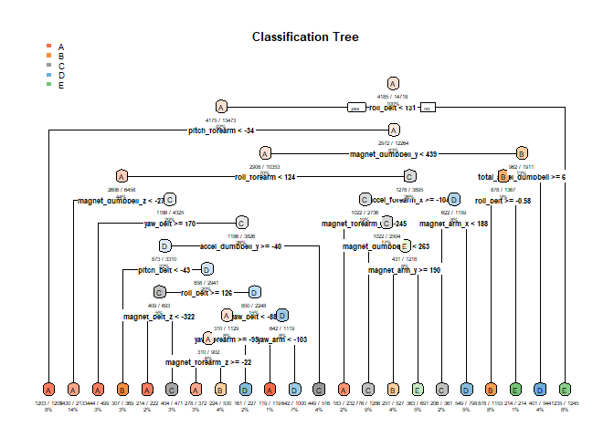

## Background

Using devices such as Jawbone Up, Nike FuelBand, and Fitbit it is now
possible to collect a large amount of data about personal activity
relatively inexpensively. These type of devices are part of the
quantified self movement – a group of enthusiasts who take measurements
about themselves regularly to improve their health, to find patterns in
their behavior, or because they are tech geeks. One thing that people
regularly do is quantify how much of a particular activity they do, but
they rarely quantify how well they do it. In this project, your goal
will be to use data from accelerometers on the belt, forearm, arm, and
dumbell of 6 participants. They were asked to perform barbell lifts
correctly and incorrectly in 5 different ways. More information is
available from the website here:
<http://groupware.les.inf.puc-rio.br/har> (see the section on the Weight
Lifting Exercise Dataset).

## Data

The training data for this project are available here:
<https://d396qusza40orc.cloudfront.net/predmachlearn/pml-training.csv>
The test data are available here:
<https://d396qusza40orc.cloudfront.net/predmachlearn/pml-testing.csv>

The data for this project come from this source:
<http://groupware.les.inf.puc-rio.br/har>. If you use the document you
create for this class for any purpose please cite them as they have been
very generous in allowing their data to be used for this kind of
assignment.

## Purpose of the Porject

The goal of your project is to predict the manner in which they did the
exercise. This is the “classe” variable in the training set. You may use
any of the other variables to predict with. You should create a report
describing how you built your model, how you used cross validation, what
you think the expected out of sample error is, and why you made the
choices you did. You will also use your prediction model to predict 20
different test cases.

## Peer Review Portion

Your submission for the Peer Review portion should consist of a link to
a Github repo with your R markdown and compiled HTML file describing
your analysis. Please constrain the text of the writeup to &lt; 2000
words and the number of figures to be less than 5. It will make it
easier for the graders if you submit a repo with a gh-pages branch so
the HTML page can be viewed online (and you always want to make it easy
on graders :-).

## Course Project Prediction Quiz Portion

Apply your machine learning algorithm to the 20 test cases available in
the test data above and submit your predictions in appropriate format to
the Course Project Prediction Quiz for automated grading.

## Reproducibility

Due to security concerns with the exchange of R code, your code will not
be run during the evaluation by your classmates. Please be sure that if
they download the repo, they will be able to view the compiled HTML
version of your analysis.

Loading Packages

    library(lattice)
    library(ggplot2)
    library(caret)
    library(randomForest)

    ## randomForest 4.6-14

    ## Type rfNews() to see new features/changes/bug fixes.

    ## 
    ## Attaching package: 'randomForest'

    ## The following object is masked from 'package:ggplot2':
    ## 
    ##     margin

    library(rpart)
    library(rpart.plot)

## Data Cleaning and Preparation

    set.seed(717)
    trainurl = "https://d396qusza40orc.cloudfront.net/predmachlearn/pml-training.csv"
    testurl = "https://d396qusza40orc.cloudfront.net/predmachlearn/pml-testing.csv"
    download.file(trainurl, "pml-training.csv")
    download.file(testurl, "pml-testing.csv")
    training <- read.csv("pml-training.csv",  na.strings=c("NA","#DIV/0!", ""))
    testing <- read.csv("pml-testing.csv",  na.strings=c("NA","#DIV/0!", ""))
    #Look for variables that could use to predict classe
    #update datasets to exclude those variables with NA values
    training <- training[,colSums(is.na(training)) == 0]
    testing <-testing[,colSums(is.na(testing)) == 0]
    #remove irrelevant variables to the prediction
    newtraining <- training[,-c(1:7)]
    newtesting <- testing[, -c(1:7)]
    #For cross validation purpose, the training data will be split into training training and training testing. 
    cv <- createDataPartition(y=newtraining$classe, p=0.75, list=FALSE)
    training_train <- newtraining[cv, ] 
    training_test <- newtraining[-cv, ]
    summary(newtraining)

    ##    roll_belt        pitch_belt          yaw_belt       total_accel_belt
    ##  Min.   :-28.90   Min.   :-55.8000   Min.   :-180.00   Min.   : 0.00   
    ##  1st Qu.:  1.10   1st Qu.:  1.7600   1st Qu.: -88.30   1st Qu.: 3.00   
    ##  Median :113.00   Median :  5.2800   Median : -13.00   Median :17.00   
    ##  Mean   : 64.41   Mean   :  0.3053   Mean   : -11.21   Mean   :11.31   
    ##  3rd Qu.:123.00   3rd Qu.: 14.9000   3rd Qu.:  12.90   3rd Qu.:18.00   
    ##  Max.   :162.00   Max.   : 60.3000   Max.   : 179.00   Max.   :29.00   
    ##   gyros_belt_x        gyros_belt_y       gyros_belt_z      accel_belt_x     
    ##  Min.   :-1.040000   Min.   :-0.64000   Min.   :-1.4600   Min.   :-120.000  
    ##  1st Qu.:-0.030000   1st Qu.: 0.00000   1st Qu.:-0.2000   1st Qu.: -21.000  
    ##  Median : 0.030000   Median : 0.02000   Median :-0.1000   Median : -15.000  
    ##  Mean   :-0.005592   Mean   : 0.03959   Mean   :-0.1305   Mean   :  -5.595  
    ##  3rd Qu.: 0.110000   3rd Qu.: 0.11000   3rd Qu.:-0.0200   3rd Qu.:  -5.000  
    ##  Max.   : 2.220000   Max.   : 0.64000   Max.   : 1.6200   Max.   :  85.000  
    ##   accel_belt_y     accel_belt_z     magnet_belt_x   magnet_belt_y  
    ##  Min.   :-69.00   Min.   :-275.00   Min.   :-52.0   Min.   :354.0  
    ##  1st Qu.:  3.00   1st Qu.:-162.00   1st Qu.:  9.0   1st Qu.:581.0  
    ##  Median : 35.00   Median :-152.00   Median : 35.0   Median :601.0  
    ##  Mean   : 30.15   Mean   : -72.59   Mean   : 55.6   Mean   :593.7  
    ##  3rd Qu.: 61.00   3rd Qu.:  27.00   3rd Qu.: 59.0   3rd Qu.:610.0  
    ##  Max.   :164.00   Max.   : 105.00   Max.   :485.0   Max.   :673.0  
    ##  magnet_belt_z       roll_arm         pitch_arm          yaw_arm         
    ##  Min.   :-623.0   Min.   :-180.00   Min.   :-88.800   Min.   :-180.0000  
    ##  1st Qu.:-375.0   1st Qu.: -31.77   1st Qu.:-25.900   1st Qu.: -43.1000  
    ##  Median :-320.0   Median :   0.00   Median :  0.000   Median :   0.0000  
    ##  Mean   :-345.5   Mean   :  17.83   Mean   : -4.612   Mean   :  -0.6188  
    ##  3rd Qu.:-306.0   3rd Qu.:  77.30   3rd Qu.: 11.200   3rd Qu.:  45.8750  
    ##  Max.   : 293.0   Max.   : 180.00   Max.   : 88.500   Max.   : 180.0000  
    ##  total_accel_arm  gyros_arm_x        gyros_arm_y       gyros_arm_z     
    ##  Min.   : 1.00   Min.   :-6.37000   Min.   :-3.4400   Min.   :-2.3300  
    ##  1st Qu.:17.00   1st Qu.:-1.33000   1st Qu.:-0.8000   1st Qu.:-0.0700  
    ##  Median :27.00   Median : 0.08000   Median :-0.2400   Median : 0.2300  
    ##  Mean   :25.51   Mean   : 0.04277   Mean   :-0.2571   Mean   : 0.2695  
    ##  3rd Qu.:33.00   3rd Qu.: 1.57000   3rd Qu.: 0.1400   3rd Qu.: 0.7200  
    ##  Max.   :66.00   Max.   : 4.87000   Max.   : 2.8400   Max.   : 3.0200  
    ##   accel_arm_x       accel_arm_y      accel_arm_z       magnet_arm_x   
    ##  Min.   :-404.00   Min.   :-318.0   Min.   :-636.00   Min.   :-584.0  
    ##  1st Qu.:-242.00   1st Qu.: -54.0   1st Qu.:-143.00   1st Qu.:-300.0  
    ##  Median : -44.00   Median :  14.0   Median : -47.00   Median : 289.0  
    ##  Mean   : -60.24   Mean   :  32.6   Mean   : -71.25   Mean   : 191.7  
    ##  3rd Qu.:  84.00   3rd Qu.: 139.0   3rd Qu.:  23.00   3rd Qu.: 637.0  
    ##  Max.   : 437.00   Max.   : 308.0   Max.   : 292.00   Max.   : 782.0  
    ##   magnet_arm_y     magnet_arm_z    roll_dumbbell     pitch_dumbbell   
    ##  Min.   :-392.0   Min.   :-597.0   Min.   :-153.71   Min.   :-149.59  
    ##  1st Qu.:  -9.0   1st Qu.: 131.2   1st Qu.: -18.49   1st Qu.: -40.89  
    ##  Median : 202.0   Median : 444.0   Median :  48.17   Median : -20.96  
    ##  Mean   : 156.6   Mean   : 306.5   Mean   :  23.84   Mean   : -10.78  
    ##  3rd Qu.: 323.0   3rd Qu.: 545.0   3rd Qu.:  67.61   3rd Qu.:  17.50  
    ##  Max.   : 583.0   Max.   : 694.0   Max.   : 153.55   Max.   : 149.40  
    ##   yaw_dumbbell      total_accel_dumbbell gyros_dumbbell_x    gyros_dumbbell_y  
    ##  Min.   :-150.871   Min.   : 0.00        Min.   :-204.0000   Min.   :-2.10000  
    ##  1st Qu.: -77.644   1st Qu.: 4.00        1st Qu.:  -0.0300   1st Qu.:-0.14000  
    ##  Median :  -3.324   Median :10.00        Median :   0.1300   Median : 0.03000  
    ##  Mean   :   1.674   Mean   :13.72        Mean   :   0.1611   Mean   : 0.04606  
    ##  3rd Qu.:  79.643   3rd Qu.:19.00        3rd Qu.:   0.3500   3rd Qu.: 0.21000  
    ##  Max.   : 154.952   Max.   :58.00        Max.   :   2.2200   Max.   :52.00000  
    ##  gyros_dumbbell_z  accel_dumbbell_x  accel_dumbbell_y  accel_dumbbell_z 
    ##  Min.   : -2.380   Min.   :-419.00   Min.   :-189.00   Min.   :-334.00  
    ##  1st Qu.: -0.310   1st Qu.: -50.00   1st Qu.:  -8.00   1st Qu.:-142.00  
    ##  Median : -0.130   Median :  -8.00   Median :  41.50   Median :  -1.00  
    ##  Mean   : -0.129   Mean   : -28.62   Mean   :  52.63   Mean   : -38.32  
    ##  3rd Qu.:  0.030   3rd Qu.:  11.00   3rd Qu.: 111.00   3rd Qu.:  38.00  
    ##  Max.   :317.000   Max.   : 235.00   Max.   : 315.00   Max.   : 318.00  
    ##  magnet_dumbbell_x magnet_dumbbell_y magnet_dumbbell_z  roll_forearm      
    ##  Min.   :-643.0    Min.   :-3600     Min.   :-262.00   Min.   :-180.0000  
    ##  1st Qu.:-535.0    1st Qu.:  231     1st Qu.: -45.00   1st Qu.:  -0.7375  
    ##  Median :-479.0    Median :  311     Median :  13.00   Median :  21.7000  
    ##  Mean   :-328.5    Mean   :  221     Mean   :  46.05   Mean   :  33.8265  
    ##  3rd Qu.:-304.0    3rd Qu.:  390     3rd Qu.:  95.00   3rd Qu.: 140.0000  
    ##  Max.   : 592.0    Max.   :  633     Max.   : 452.00   Max.   : 180.0000  
    ##  pitch_forearm     yaw_forearm      total_accel_forearm gyros_forearm_x  
    ##  Min.   :-72.50   Min.   :-180.00   Min.   :  0.00      Min.   :-22.000  
    ##  1st Qu.:  0.00   1st Qu.: -68.60   1st Qu.: 29.00      1st Qu.: -0.220  
    ##  Median :  9.24   Median :   0.00   Median : 36.00      Median :  0.050  
    ##  Mean   : 10.71   Mean   :  19.21   Mean   : 34.72      Mean   :  0.158  
    ##  3rd Qu.: 28.40   3rd Qu.: 110.00   3rd Qu.: 41.00      3rd Qu.:  0.560  
    ##  Max.   : 89.80   Max.   : 180.00   Max.   :108.00      Max.   :  3.970  
    ##  gyros_forearm_y     gyros_forearm_z    accel_forearm_x   accel_forearm_y 
    ##  Min.   : -7.02000   Min.   : -8.0900   Min.   :-498.00   Min.   :-632.0  
    ##  1st Qu.: -1.46000   1st Qu.: -0.1800   1st Qu.:-178.00   1st Qu.:  57.0  
    ##  Median :  0.03000   Median :  0.0800   Median : -57.00   Median : 201.0  
    ##  Mean   :  0.07517   Mean   :  0.1512   Mean   : -61.65   Mean   : 163.7  
    ##  3rd Qu.:  1.62000   3rd Qu.:  0.4900   3rd Qu.:  76.00   3rd Qu.: 312.0  
    ##  Max.   :311.00000   Max.   :231.0000   Max.   : 477.00   Max.   : 923.0  
    ##  accel_forearm_z   magnet_forearm_x  magnet_forearm_y magnet_forearm_z
    ##  Min.   :-446.00   Min.   :-1280.0   Min.   :-896.0   Min.   :-973.0  
    ##  1st Qu.:-182.00   1st Qu.: -616.0   1st Qu.:   2.0   1st Qu.: 191.0  
    ##  Median : -39.00   Median : -378.0   Median : 591.0   Median : 511.0  
    ##  Mean   : -55.29   Mean   : -312.6   Mean   : 380.1   Mean   : 393.6  
    ##  3rd Qu.:  26.00   3rd Qu.:  -73.0   3rd Qu.: 737.0   3rd Qu.: 653.0  
    ##  Max.   : 291.00   Max.   :  672.0   Max.   :1480.0   Max.   :1090.0  
    ##     classe         
    ##  Length:19622      
    ##  Class :character  
    ##  Mode  :character  
    ##                    
    ##                    
    ## 

## Decision Tree

    tree_mod <- rpart(classe ~ ., data=training_train, method="class")
    tree_pred <- predict(tree_mod, training_test, type = "class")
    rpart.plot(tree_mod, main = "Classification Tree", extra=102, under=TRUE, faclen = 0, cex = .5)

    #confusionMatrix(tree_pred, training_test$classe)$overall[1]

## Random Forest

    #rf_mod <- randomForest(classe ~. , data = training_train, method = "class")
    #rf_pred <- predict(rf_mod, training_test, type = "class")
    #confusionMatrix(rf_pred, training_test$classe)

Looking at the results, clearly, the random forest model provides a more
accurate prediction of classe with 0.9955 compare to decision tree’s
0.7488. The expected out-of-sample error is estimated at 0.005.
